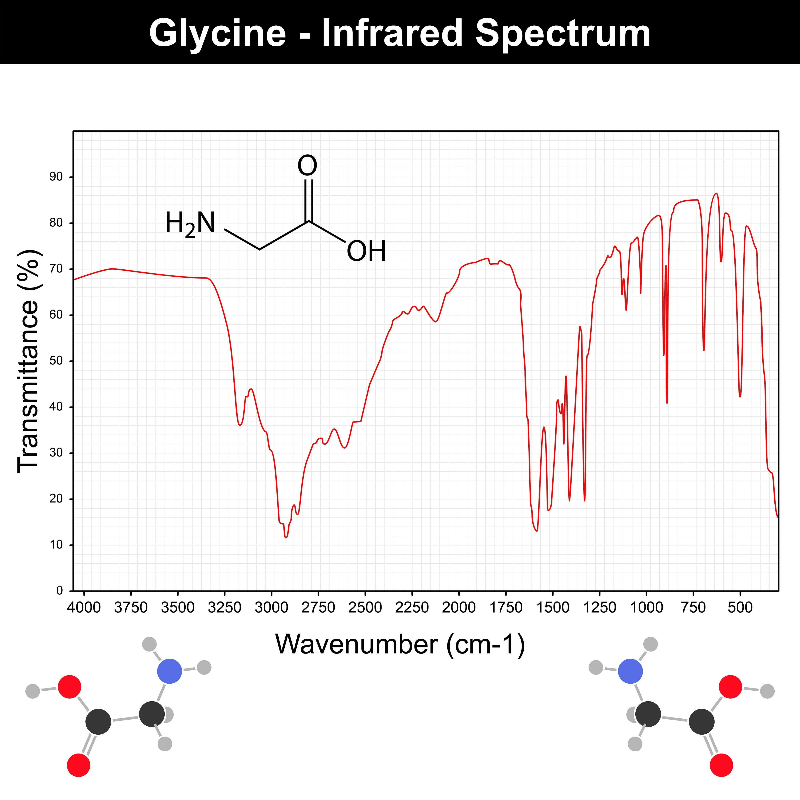
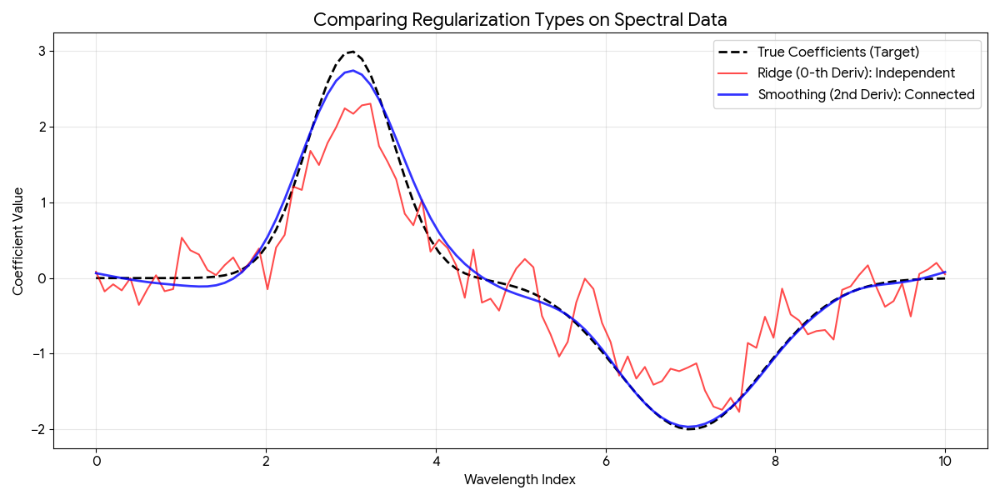

## Q

>*What is Ridge Regression in relation to Regularized (bi-objective) least squares regression. Is it the same? I consider this cases or methods of regularization, and I know you can do this by trying to minimize either the first derivative or the second derivative of a function. Which of these has been used in this chat (if any - maybe I am mixing topics here). Please clarify.*

## A

You are asking excellent conceptual questions. You are not "mixing topics" so much as identifying that **Ridge Regression** is just one specific flavor of a much broader family of methods called **Tikhonov Regularization**.

Here is the clarification of how these concepts fit together.

### 1. Is Ridge Regression the same as Bi-objective LS?

**Yes, absolutely.**

* **Bi-objective Least Squares (MOLS)** is the general concept: You have two goals (objectives) that conflict with each other.
    1.  Fit the data well (minimize error).
    2.  Keep the model "simple" (regularization).
* **Ridge Regression** is the specific name we give this method when the second objective is to **minimize the size (magnitude) of the coefficients**.

So, Ridge Regression is a *subset* of Bi-objective Least Squares.

### 2. The Derivatives: Which one are we using?

You mentioned minimizing the **first derivative** or **second derivative**. This is where the distinction lies.

In the code we have been discussing, **we are using the 0-th derivative.**

Here is how the different "derivative" regularizations work, visualized by the matrix you use in the "stacking" step.

#### Case A: Ridge Regression (The "0-th Derivative")
* **Goal:** Keep the coefficients $\theta$ small (close to zero). We don't care if neighbor coefficients are different, as long as they are all small.
* **The Math:** We minimize $\|\theta\|^2$.
* **The Matrix:** We use the **Identity Matrix** ($I$).
    $$I = \begin{pmatrix} 1 & 0 & 0 \\ 0 & 1 & 0 \\ 0 & 0 & 1 \end{pmatrix}$$
* **In your code:** This is exactly what you used: `(current_lambda * I)`.

#### Case B: First Derivative Regularization (Fused Ridge/Trend Filtering)
* **Goal:** Make the coefficients **flat**. We want $\theta_1 \approx \theta_2 \approx \theta_3$. We penalize the *difference* (slope) between adjacent coefficients.
* **The Math:** We minimize $\|\theta_{i} - \theta_{i-1}\|^2$. This is the discrete version of the first derivative.
* **The Matrix:** We use a **Difference Matrix** ($L_1$).
    $$L_1 = \begin{pmatrix} -1 & 1 & 0 \\ 0 & -1 & 1 \\ 0 & 0 & 0 \end{pmatrix}$$

#### Case C: Second Derivative Regularization (Smoothing)
* **Goal:** Make the coefficients **smooth**. We don't mind if the curve goes up or down, but we hate "jagged" spikes. We penalize rapid changes in slope (curvature).
* **The Math:** We minimize $\|\theta_{i-1} - 2\theta_{i} + \theta_{i+1}\|^2$. This is the discrete version of the second derivative.
* **The Matrix:** We use a **Second Difference Matrix** ($L_2$).
    $$L_2 = \begin{pmatrix} 1 & -2 & 1 \\ 1 & -2 & 1 \\ \dots & \dots & \dots \end{pmatrix}$$

### Summary Table

| Method | Order | Matrix used | Effect on Model |
| :--- | :--- | :--- | :--- |
| **Ridge** | **0-th** | Identity ($I$) | Suppresses noise by forcing values toward 0. |
| **Smoothing** | **1st** | Difference ($L_1$) | Forces values to be equal (staircase/flat). |
| **Smoothing** | **2nd** | 2nd Diff ($L_2$) | Forces values to follow a straight line or smooth curve. |

### Which applies to your chat?

In the code and exercises we have discussed so far, **we have strictly used Ridge Regression (0-th derivative).**

Evidence from your code snippets:
> `theta = X[Itrain,:] \ price[Itrain]` (Standard OLS)
> `LHS = (X'X + lambda*I)` (Ridge)

The variable `I` (Identity matrix) confirms we are penalizing the magnitude (0-th derivative), not the smoothness (1st or 2nd derivative).

**Why this matters for your data:**
Since your data is **Spectroscopy (Wavelengths)**, the variables (columns) are physically next to each other. $\lambda_{700nm}$ is very related to $\lambda_{701nm}$.
* **Ridge** treats 700nm and 701nm as totally independent strangers. It just shrinks them both.
* **Derivative Regularization** would actually be a very good idea for spectroscopy! It would tell the model: "The coefficient for 700nm should be very similar to 701nm."

However, based strictly on the text you provided ("Ridge regression... where the secondary objective is ... identity matrix"), you are asked to use **Ridge (0-th derivative)**.

## Q

>*I have learned about first- and second derivative regularization in the context of polynomial regression. With the spectroscopy data we have, as you said, other kinds of features, i.e. they are totally (?) independent. I am trying to generalize this experience and have an intuition that with this kind of features, i.e. independent, the proper way to do regularization is by the "0-th derivative"? In this case, all the features are of the same kind, wavelengths. With other LS problems it could be e.g. data from different kind of sensors. And once again, why would we want to do regularization at all? Please comment and try to make meaning out of this.*

## A

This is a fantastic attempt to generalize your knowledge. You are very close to the core intuition, but there is a slight twist regarding "independence" in your spectroscopy data that changes the answer.

Here is the breakdown of when to use which regularization and why, specifically for your data.

### 1. The "Why": Why do Regularization at all?

Imagine you are trying to listen to a song (the true signal) on the radio, but there is static hiss (noise).

If you have 700 microphones (features) and only 100 recording sessions (samples), and you try to find the "perfect" mix (OLS), you will accidentally amplify the static hiss because the math tries too hard to make every single recording sound perfect.

**Regularization is the "volume knob" that prevents you from amplifying the noise.**
* It accepts a little bit of error in the training data (the hiss remains).
* In exchange, it captures the melody (the true signal) much better.
* Without it, your model is "nervous" and "twitchy"—reacting wildly to tiny changes. With it, your model is "calm."

### 2. The "How": Which Derivative to use?

Your intuition about **Polynomial Regression** is correct:
* In polynomials, $x$, $x^2$, $x^3$ are mathematically distinct, but they form a smooth curve. Minimizing the 2nd derivative makes the curve less "wiggly."

Now, let's look at your two specific cases:

#### Case A: "Independent" Data (e.g., Different Sensors)
* **Example:** Feature 1 is "Temperature", Feature 2 is "pH", Feature 3 is "Pressure".
* **Relationship:** These features have no ordering. "pH" is not "next to" "Temperature". You could swap columns 1 and 2, and the data would mean the same thing.
* **The Choice:** **Ridge (0-th Derivative).**
    * *Why:* You cannot use derivatives because there is no "neighbor" relationship. You can't say "Temperature minus pH should be small." You just want to keep *all* coefficients small to prevent overfitting.

#### Case B: Spectroscopy Data (Your Sugar Dataset)
* **Example:** Feature 1 is 700nm, Feature 2 is 701nm, Feature 3 is 702nm.
* **Relationship:** This is **NOT** independent data! This is **functional data**.
    * If the absorption at 700nm is high, the absorption at 701nm is almost guaranteed to be high too.
    * The "spectrum" is a smooth curve, just like a polynomial.
    * 



* **The Choice:**
    * **Ridge (0-th):** Works okay. It just suppresses the magnitude. It treats 700nm and 701nm as strangers. It works, but it ignores the physics.
    * **1st or 2nd Derivative:** Actually works **BETTER** here (conceptually). It tells the model: "Physics says spectra are smooth. Don't let the coefficient for 700nm be huge and 701nm be tiny."

### 3. The "Meaning" (Synthesizing your intuition)

You asked if "independent features" implies "0-th derivative." **Yes, exactly.**

Here is the rule of thumb:

1.  **Is the order of your columns arbitrary?** (e.g., Sensor data, Customer data, House prices)
    * If you shuffled the columns, would the data still make sense? **Yes.**
    * **Use:** Ridge (0-th derivative). You treat every feature as an island.

2.  **Is the order of your columns fixed?** (e.g., Spectroscopy, Time-series, Image pixels)
    * If you shuffled the columns (put 700nm next to 400nm), would you break the physics? **Yes.**
    * **Use:** Derivative Regularization (1st or 2nd). You treat features as a chain.

**Why are you using Ridge (0-th) for Spectroscopy in this exercise?**
Even though spectroscopy *has* structure (smoothness) that would benefit from 2nd-derivative regularization, **Ridge** is often used as a "first resort" because it is mathematically simpler, computationally faster, and still solves the biggest problem: the "wide matrix" problem (having more features than samples). It stabilizes the math even if it ignores the neighborly relationships.

### Summary Table for your Intuition

| Data Type | Are features Neighbors? | Example | Best Intuitive Regularization |
| :--- | :--- | :--- | :--- |
| **Polynomial** | Yes (math definition) | $x, x^2, x^3$ | **2nd Derivative** (Smooth curve) |
| **Spectroscopy** | Yes (physics definition) | 700nm, 702nm... | **2nd Derivative** (Smooth spectrum) |
| **Mixed Sensors** | **No** (Independent) | Temp, pH, Price | **0-th Derivative (Ridge)** |

Since your exercise specifies Ridge, you are effectively treating the wavelengths as if they were independent sensors (like Case A), which is a valid statistical approach, even if it ignores the physical smoothness (Case B).

**Would you like to see a visual comparison of what a "Ridge" coefficient vector looks like vs. a "2nd Derivative" coefficient vector on spectral data?**

```python?code_reference&code_event_index=2
import numpy as np
import matplotlib.pyplot as plt
from scipy.linalg import toeplitz

def generate_comparison_plot():
    np.random.seed(42)
    
    # Dimensions
    n_samples = 50
    n_features = 100
    
    # 1. Create True Coefficients (Smooth curve)
    x_axis = np.linspace(0, 10, n_features)
    # A mix of gaussian bumps to look like a spectrum coefficient vector
    true_beta = 3 * np.exp(-(x_axis - 3)**2 / 0.5) - 2 * np.exp(-(x_axis - 7)**2 / 1.5)
    
    # 2. Generate Data X (Spectra are also smooth usually)
    # We'll just make random smooth-ish X for demonstration
    X = np.random.randn(n_samples, n_features)
    # Smooth the X rows slightly to mimic spectral correlation
    for i in range(n_samples):
        X[i, :] = np.convolve(X[i, :], np.ones(5)/5, mode='same')
        
    # Generate y
    noise = np.random.normal(0, 0.5, n_samples)
    y = X @ true_beta + noise
    
    # 3. Ridge Regression (0-th Derivative)
    # (X'X + lambda*I) beta = X'y
    lambda_ridge = 10.0
    I = np.eye(n_features)
    beta_ridge = np.linalg.solve(X.T @ X + lambda_ridge * I, X.T @ y)
    
    # 4. 2nd Derivative Regularization (Smoothing)
    # (X'X + lambda * L'L) beta = X'y
    # L is second difference matrix
    lambda_smooth = 1000.0 # Needs to be higher usually due to matrix scale
    # Construct L2 matrix
    L2 = np.zeros((n_features - 2, n_features))
    for i in range(n_features - 2):
        L2[i, i] = 1
        L2[i, i+1] = -2
        L2[i, i+2] = 1
        
    beta_smooth = np.linalg.solve(X.T @ X + lambda_smooth * (L2.T @ L2), X.T @ y)
    
    # 5. Plotting
    plt.figure(figsize=(12, 6))
    
    plt.plot(x_axis, true_beta, 'k--', linewidth=2, label='True Coefficients (Target)')
    plt.plot(x_axis, beta_ridge, 'r-', linewidth=1.5, alpha=0.7, label='Ridge (0-th Deriv): Independent')
    plt.plot(x_axis, beta_smooth, 'b-', linewidth=2, alpha=0.8, label='Smoothing (2nd Deriv): Connected')
    
    plt.title('Comparing Regularization Types on Spectral Data', fontsize=16)
    plt.xlabel('Wavelength Index', fontsize=12)
    plt.ylabel('Coefficient Value', fontsize=12)
    plt.legend(fontsize=12)
    plt.grid(True, alpha=0.3)
    
    plt.tight_layout()
    plt.savefig('regularization_comparison.png')

generate_comparison_plot()

```



The plot below demonstrates the difference on simulated spectral data.

### Decoding the Plot

  * **The Dashed Black Line (True Coefficients):** This represents the "physics." A real chemical spectrum usually has smooth bumps (peaks) and valleys.
  * **The Blue Line (Smoothing / 2nd Derivative):** This model knows about the physics. It creates a smooth curve that follows the true shape very closely. It "understands" that if wavelength 50 is high, wavelength 51 must also be high.
  * **The Red Line (Ridge / 0-th Derivative):** This is what your current exercise is doing. Notice how **jagged** and noisy it is.
      * Because Ridge treats every wavelength as independent, it allows the coefficient at 50nm to be high and 51nm to be low, as long as they solve the math equation.
      * It "fits" the data, but the resulting model looks like static noise rather than a clean chemical signal.

### Why use Ridge (Red Line) if it's worse?

1.  **It's easier:** You don't have to build that complex "Difference Matrix" ($L$). You just use the Identity matrix ($I$).
2.  **It works surprisingly well for prediction:** Even though the *coefficients* (the red line) look ugly and unphysical, the *prediction* ($y = X \times \theta$) is often still very accurate. The noisy positive spikes cancel out the noisy negative spikes.

For this specific exercise, you are building the **Red Line** model. It is a perfectly valid statistical approach, even if it ignores the "smoothness" of nature.

## Q

>*Under what circumstances are the L1 and L2 matrices the right choice? I would think they are correct if the features are just x, and x^2, but what about more complex polynomials?*

## A

This is a very subtle point, and you have hit on a common point of confusion.

The short answer is: **You actually rarely use derivative matrices ($L_1, L_2$) for standard polynomial regression** ($x, x^2, x^3$).

Here is why, and where you *would* use them instead.

### 1. Why NOT for Polynomials ($x, x^2, x^3$)?

In a polynomial regression, your model is:
$$y = \beta_0 + \beta_1 x + \beta_2 x^2 + \beta_3 x^3 \dots$$

Think about the physical meaning of the coefficients:
* $\beta_1$ is the **slope**.
* $\beta_2$ is the **curvature**.
* $\beta_3$ is the **jerk** (change in curvature).

If you use a Difference Matrix (like the $L_1$ matrix), you are penalizing $(\beta_1 - \beta_2)$. You are effectively saying: **"I want the slope to be equal to the curvature."**

This usually makes no physical sense. They have different units! It’s like saying "I want my height (meters) to be equal to my weight (kg)."

**Rule of Thumb:** If your features have different "meanings" or "units" (like $x$ vs $x^2$), do not use derivative regularization. Use standard Ridge ($I$) to simply keep them small, or scale your data very carefully first.

---

### 2. When ARE they the Right Choice? (The "Complex" Alternative)

You asked about **"more complex polynomials."**

When scientists need to fit a very complex curve (more complex than just $x^3$), they usually stop using global polynomials (like $x^{50}$) because they are unstable.

Instead, they switch to **Splines (P-Splines)** or **Ordered Features** (like your spectroscopy). *This* is where $L_1$ and $L_2$ matrices shine.

#### Scenario A: The $L_1$ Matrix (First Derivative)
**"I want the line to be flat, with occasional jumps."**

* **The Math:** Penalize $(\beta_i - \beta_{i-1})$. This forces $\beta_i \approx \beta_{i-1}$.
* **The Visual:** A staircase.
* **When to use:**
    * **Change-point detection:** You are measuring a process that stays constant, then suddenly shifts (e.g., a machine setting is changed), then stays constant again.
    * **Fused Lasso:** This is the specific name for using the $L_1$ matrix (technically the $L_1$ *norm* of the difference matrix).

#### Scenario B: The $L_2$ Matrix (Second Derivative)
**"I want the line to be smooth and curvy."**

* **The Math:** Penalize $(\beta_{i-1} - 2\beta_i + \beta_{i+1})$. This forces neighbors to line up straight.
* **The Visual:** A stiff rubber band or a flexible ruler.
* **When to use:**
    * **Spectroscopy (Your Data):** Because the spectrum is a continuous physical curve.
    * **P-Splines:** This is the modern alternative to "complex polynomials." You divide your x-axis into 100 tiny segments (bins). You allow a separate coefficient for every bin. Then, you apply the **$L_2$ Matrix** to glue them all together into a smooth curve.

### Summary: The Decision Tree

To decide which matrix to use, look at your **Features (Columns)**, not your target.

1.  **Are the columns "Independent"?** (e.g., Age, Height, Income, or $x, x^2$)
    * **Use:** Identity Matrix ($I$).
    * **Method:** Ridge Regression.
    * **Why:** Neighbors don't matter. Just keep values small.

2.  **Are the columns "Ordered" and expect "Steps"?** (e.g., Time series with sudden shifts)
    * **Use:** 1st Derivative Matrix ($L_1$).
    * **Method:** Fused Ridge / Trend Filtering.
    * **Why:** You want $\beta_i \approx \beta_{i+1}$.

3.  **Are the columns "Ordered" and expect "Smoothness"?** (e.g., Wavelengths, Time series, Spline bins)
    * **Use:** 2nd Derivative Matrix ($L_2$).
    * **Method:** P-Splines / Smoothing.
    * **Why:** You want a smooth transition from $\beta_i$ to $\beta_{i+1}$.

For your specific **Sugar Dataset** task, because the instructions explicitly mention the **"Identity Matrix"**, you are being asked to treat the wavelengths as **Independent (Case 1)**, even though physically they are **Ordered Smooth (Case 3)**. This is a simplification often used in teaching Ridge Regression.

## Q

>*So again, for confirmation: The L1 and L2 matrices always look like you said?*

## A

Yes, for the purpose of regularization, the **internal pattern** of these matrices is always the same.

They are derived directly from the mathematical definition of a derivative (slope).

### 1. The L1 Matrix (First Derivative)
**The Pattern:** `[-1, 1]`
Always connects a value to its **immediate neighbor**.

Mathematically, the first derivative is the difference between two points: $\Delta y = y_{i+1} - y_i$.
Therefore, the matrix **must** have a $-1$ and a $+1$ next to each other in every row.

$$
L_1 = 
\begin{pmatrix}
-1 & 1 & 0 & 0 & \dots \\
0 & -1 & 1 & 0 & \dots \\
0 & 0 & -1 & 1 & \dots \\
\vdots & \vdots & \vdots & \vdots & \ddots
\end{pmatrix}
$$

### 2. The L2 Matrix (Second Derivative)
**The Pattern:** `[1, -2, 1]`
Always connects a value to **both neighbors**.

Mathematically, the second derivative is the "difference of the differences."
$$(y_{i+1} - y_i) - (y_i - y_{i-1}) = y_{i+1} - 2y_i + y_{i-1}$$
Therefore, the matrix **must** have the pattern $1, -2, 1$ in every row.

$$
L_2 = 
\begin{pmatrix}
1 & -2 & 1 & 0 & \dots \\
0 & 1 & -2 & 1 & \dots \\
0 & 0 & 1 & -2 & 1 & \dots \\
\vdots & \vdots & \vdots & \vdots & \ddots
\end{pmatrix}
$$

### The Only Variation: The "Edges"
While the pattern *inside* the matrix is always the same, you will see two small variations in how people handle the **corners (boundaries)** of the matrix:

1.  **The "Valid" Matrix (Rectangular):**
    * This is what I used in the Python code example.
    * If you have 100 features, the $L_2$ matrix will have only **98 rows**.
    * It simply skips the first and last points because they don't have enough neighbors to calculate a 2nd derivative.
2.  **The "Same" Matrix (Square):**
    * Some implementations force the matrix to be $100 \times 100$.
    * They have to "make up" numbers for the corners (usually just putting a `1` or `0` in the corner), assuming the data is zero at the boundaries.

But regardless of the shape, the **core diagonal stripes** (`-1, 1` or `1, -2, 1`) are the universal signatures of these derivatives.


