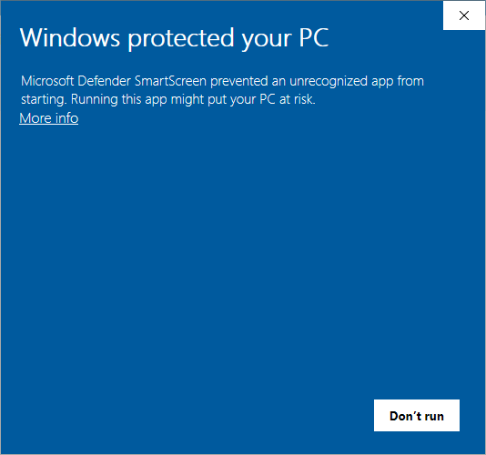
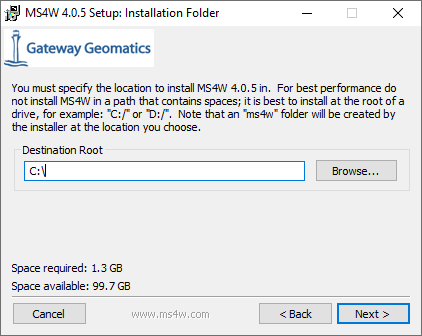
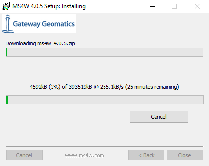
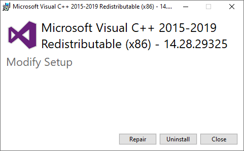
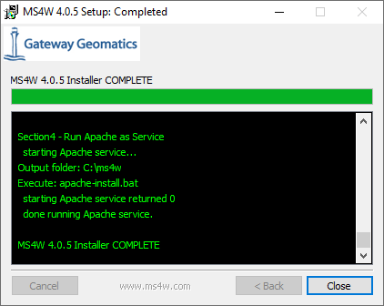

# Ukeoppgave: Installasjon av Mapserver på egen PC

## Hva er mapserver?

> MapServer is an Open Source platform for publishing spatial data and interactive mapping applications to the web. Originally developed in the mid-1990’s at the University of Minnesota, MapServer is released under an MIT-style license, and runs on all major platforms (Windows, Linux, Mac OS X). MapServer is not a full-featured GIS system, nor does it aspire to be

Se mer om hvordan Mapserver-prosjektet presenterer seg selv her: 

- [https://mapserver.org/about.html](https://mapserver.org/about.html)

Mapserver brukes av mange aktører innen den norske geografiske infrastrukturen, bl. a. for WMS-tjenester fra Geonorge/Kartverket.


## Hva er MS4W?

Mapserver kan tilpasses bruk på mange plattformer og til mange formål. Noe av dette inkluderer behov for kompilering fra kildekode.

MS4W er en ferdigkompilert pakke (binary) for Windows som kommer med de funksjonene vi trenger. 

> The purpose of this package is to allow novice to advanced MapServer users to quickly install a MapServer development environment on their Windows systems. The reasons for needing to do this are diverse but, in general, this package supports: developers who want to get to a stable state quickly, trainers who need an easily-installed configuration identical across multiple installs, and novices who need help just getting all the needed bits and pieces together.

Se mer om MS4W her - blant annet hvilke geodataformater som kan brukes (OGR og GDAL): 

- [MapServer for Windows (MS4W) README](https://www.ms4w.com/README_INSTALL.html)

Et avsnitt på denne siden forklarer hvordan caching (WMTS) kan aktiveres med mapcache-modulen:

- [MapCache Apache Module](https://www.ms4w.com/README_INSTALL.html#mapcache-apache-module)

Vi skal ikke bruke WMTS med Mapserver i GEOM2430.


## Installasjon på Windows 10

Her følger detaljert beskrivelse av installasjonsprosedyre. Det er viktig å følge denne nøye.

- Last ned installasjonsfil, ms4w-5.0.0-setup.exe, fra denne siden: [https://www.ms4w.com/index.html](https://www.ms4w.com/index.html)

Start installasjon, aksepter sikkerhetsadvarsel (_More info_):



Velg _Run anyway_


Kryss av for OpenLayers - la resten stå urørt


Aksepter standard installasjonsmappe under C:\
(mappen ms4w vil bli oppretttet under installasjonen)



Installasjonen (inkluderer nedlasting) kan ta litt tid



Du vil sannsynligvis få spørsmål om å installere ekstra programbibliotek for Visual C++.
Det trengs for å kjøre Mapserver. (Ved 2. gangs installsjon fikk jeg opp disse valgene - det stod antageligvis install i stedet for repair første gang).



Forhåpentligvis kommer dette bildet opp til slutt.




## Kontrollere at installasjonen er vellykket

Hvis alt har gått bra gjennom installasjonen, skal du nå ha en Apache Web-server kjørende på PC'en. Du kan teste dette ved å gå til en av disse url'ene i nettleseren:

- [http://localhost](http://localhost)
- [http://127.0.0.1](http://127.0.0.1)

En WMS-tjeneste er installert på denne adressen:
- [http://localhost/cgi-bin/mapserv.exe?map=/ms4w/apps/local-demo/local.map](http://localhost/cgi-bin/mapserv.exe?map=/ms4w/apps/local-demo/local.map)

Uten noen ekstra parametre vil WMS-url'en gi en feilmelding:

```HTML
mapserv(): Web application error. Traditional BROWSE mode requires a TEMPLATE in the WEB section, but none was provided. 
```

Med GetCapabilities-parametre:
- [http://localhost/cgi-bin/mapserv.exe?map=/ms4w/apps/local-demo/local.map&SERVICE=WMS&VERSION=1.3.0&REQUEST=GETCAPABILITIES](http://localhost/cgi-bin/mapserv.exe?map=/ms4w/apps/local-demo/local.map&SERVICE=WMS&VERSION=1.3.0&REQUEST=GETCAPABILITIES)


## Lage en egen WMS-tjeneste

1. Hent ned et datasett med kommuneinndeling innenfor et fylke fra Geonorge. Datasettet skal bestå av polygoner. Datasettet lastes ned på FGDB-format.
2. Lag mappe for tjenesten under _C:\ms4w\apps_, f.eks. _C:\ms4w\apps\innlandet_
3. Legg inn FGDB-fil (mappe) i denne mappen igjen, f.eks. *C:\ms4w\apps\innlandet\Basisdata_34_Innlandet_25832_Kommuner_FGDB.gdb*
4. Legg inn og tilpass en mapfile i mappen for tjenesten. Ta utgangspunkt i følgende mal: [innlandet.map](docs/innlandet.map.txt).
5. Test tjenesten ved å lage en url med GetCapabilities-parametre som vist ovenfor.
5. Lag en WMS-tjeneste for disse kartdatene med utgangspunkt i oppsettet som du nå skal ha i mappen 'C:\ntnugeo\apps\ntnustudent\innlandet'.

## Lage webkart for egen WMS-tjeneste

Ta utgangspunkt i lærestoffet under Open Layers, og lag et webkart som viser fram din egen WMS-tjeneste.

\
_NTNU 10.03.2025 Sverre Stikbakke_