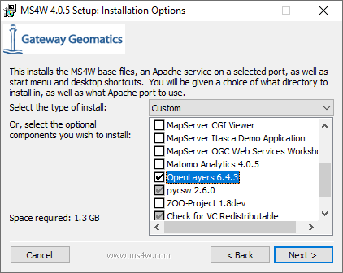

# Introduksjon til Mapserver - installasjon på egen PC


## Hva er mapserver?

> MapServer is an Open Source platform for publishing spatial data and interactive mapping applications to the web. Originally developed in the mid-1990’s at the University of Minnesota, MapServer is released under an MIT-style license, and runs on all major platforms (Windows, Linux, Mac OS X). MapServer is not a full-featured GIS system, nor does it aspire to be

Se mer om hvordan Mapserver-prosjektet presenterer seg selv her: 

- [https://mapserver.org/about.html](https://mapserver.org/about.html)

Mapserver brukes av mange aktører innen den norske geografiske infrastrukturen, bl. a. for WMS-tjenester fra Geonorge/Kartverket.

- [Anatomy of a MapServer Application](https://mapserver.org/introduction.html#anatomy-of-a-mapserver-application)


## Hva er MS4W?

Mapserver kan tilpasses bruk på mange plattformer og til mange formål. Noe av dette inkluderer behov for kompilering fra kildekode.

MS4W er en ferdigkompilert pakke (binary) for Windows som kommer med de funksjonene vi trenger. 

> The purpose of this package is to allow novice to advanced MapServer users to quickly install a MapServer development environment on their Windows systems. The reasons for needing to do this are diverse but, in general, this package supports: developers who want to get to a stable state quickly, trainers who need an easily-installed configuration identical across multiple installs, and novices who need help just getting all the needed bits and pieces together.

Se mer om MS4W her - blant annet hvilke geodataformater som kan brukes (OGR og GDAL): 

- [MapServer for Windows (MS4W) README](https://www.ms4w.com/README_INSTALL.html)

Et avsnitt på denne siden forklarer hvordan caching (WMTS) kan aktiveres med mapcache-modulen:

- [MapCache Apache Module](https://www.ms4w.com/README_INSTALL.html#mapcache-apache-module)

Vi skal ikke bruke WMTS med Mapserver i GEOM2430.


## Installasjon på Windows 10/11

Her følger detaljert beskrivelse av installasjonsprosedyre. Det er viktig å følge denne nøye.

- Last ned installasjonsfil, ms4w-5.0.0-setup.exe, fra denne siden: [https://www.ms4w.com/index.html](https://www.ms4w.com/index.html)

Start installasjon
(Bildene nedenfor er fra versjon 4.x, men er ellers like med versjon 5.x)

Kryss av for OpenLayers - la resten stå urørt



Aksepter standard installasjonsmappe under C:\
(mappen ms4w vil bli oppretttet under installasjonen)


Installasjonen (inkluderer nedlasting) kan ta litt tid


Forhåpentligvis kommer dette bildet opp til slutt.


## Hva er Apache?

En sentral del av Mapserver-installasjonen er Apache webserver. Webserveren tar imot forepørsler fra klientene og leverer filer og kartbilder. Kartbildene generereres i en egen mapserver-modul som kalles ved hjelp av CGI. 

Fra Wikipedia:

> In computing, Common Gateway Interface (CGI) is an interface specification that enables web servers to execute an external program to process HTTP or HTTPS user requests. 


## CORS-oppsett for Apache

CORS (Cross-Origin Resource Sharing) er en mekanisme som tillater en nettleser å hente inn ressurser fra flere kilder, til scriptene som kjøres på en nettside.

I vår sammenheng er dette aktuelt hvis html-fila ligger i en mappe og hentes inn enten via direkte klikk i en mappe eller startes via en annen webserver enn der WMS/WMTS-tjenesten ligger. Scriptene, f.eks. Open Layers web-kart-script, vil da bli hentet fra der vi har html- og javascript-kodefilene. Når vi deretter kontakter WMS- eller WMTS-tjenestene som ligger under Apache web-serveren, vil vår nettleser merke at scriptene våre vil kontakte et annet nettsted enn der kodefilene ligger. Dette er i utgangspunktet ikke tillatt - av sikkerhets-hensyn. 

Løsningen på dette er å få Apache til å legge inn en melding i sine HTTP Headers, som forteller vår nettleser at det er trygt å hente ressurser derfra likevel.
Legg inn denne linjen i _C:\ms4w\Apache\conf\httpd.conf_, gjerne til slutt i fila.

```html
Header set Access-Control-Allow-Origin "*"
```
Ta deretter en omstart av Apache.

Hvis du vil vite mer kan du lese om CORS her: [developer.mozilla.org](https://developer.mozilla.org/en-US/docs/Web/HTTP/CORS)


## Omstart av Apache

Apache kan startes på nytt ved hjelp av _MS4W-Apache-Monitor_ (Windows startmeny, under MS4W). Programmet legger seg på oppgavelinjen i Windows ved oppstart.


## Kontrollere at installasjonen er vellykket

Hvis alt har gått bra gjennom installasjonen, skal du nå ha en Apache Web-server kjørende på PC'en. Du kan teste dette ved å gå til en av disse url'ene i nettleseren:

- [http://localhost](http://localhost)
- [http://127.0.0.1](http://127.0.0.1)


#### WMS-tjeneste under _apps/local-demo_

En WMS-tjeneste er installert på denne adressen:
- [http://localhost/cgi-bin/mapserv.exe?map=/ms4w/apps/local-demo/local.map](http://localhost/cgi-bin/mapserv.exe?map=/ms4w/apps/local-demo/local.map)

Uten noen ekstra parametre vil WMS-url'en gi en feilmelding:

```HTML
mapserv(): Web application error. Traditional BROWSE mode requires a TEMPLATE in the WEB section, but none was provided. 
```

Med GetCapabilities-parametre:
- [http://localhost/cgi-bin/mapserv.exe?map=/ms4w/apps/local-demo/local.map&SERVICE=WMS&VERSION=1.3.0&REQUEST=GETCAPABILITIES](http://localhost/cgi-bin/mapserv.exe?map=/ms4w/apps/local-demo/local.map&SERVICE=WMS&VERSION=1.3.0&REQUEST=GETCAPABILITIES)


#### Open Layers webkart som viser tjeneste under _apps/openlayers-6.6.1/examples/map_

Dette krever at CORS-oppsettet er lagt inn og at Apache er startet på nytt.

- [Open Layers verdenskart](http://localhost/openlayers/examples/mapserver-wms.html)


## Neste steg - sette opp en egen WMS-tjeneste med egne data

- [Ukeoppgave med Mapserver](mapserver-ukeoppgave.md)

\
_NTNU 10.03.2025 Sverre Stikbakke_