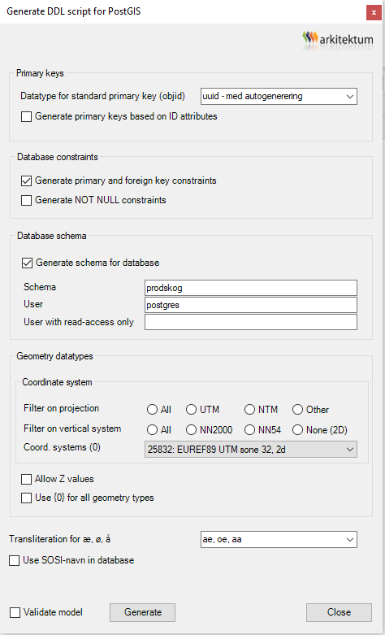

# Alternativ til FME for å laste data til PostGIS database


Denne beskrivelsen er knyttet til [Ukeoppgave om PSTools, GISTools, Postgis og FME](ukeoppgave-PsTools-GISTools-PostGIS-FME.md)


## Generering av SQL-fil for PostGIS databaseskjema

I Enterprise Architect/GISTools: velg uuid med autogenerering som vist her: 




## ogr2ogr-kommando

Løsningen bygger på bruk av ogr2ogr-programmet som bl.a. følger med QGIS-installasjonen.

1. Start OSGeo4W Shell fra Windows startmeny - under QGIS
2. Naviger til mappe der du har fgdb-fil som skal lastes

Gi kommandoen nedenfor - (sett riktig database-navn og passord) - `^`-tegnet gjør at alle linjene settes sammen til én kommando

```c
ogr2ogr -f PostgreSQL ^
PG:"dbname='t2501' host='localhost' port='5432' user='postgres' password='gulogulo'" ^
Basisdata_1133_Hjelmeland_25832_FKB-AR5_FGDB.gdb ^
-lco GEOMETRY_NAME=omraade ^
-append ^
-explodecollections ^
-nln prodskog.arealressursflate ^
-sql "SELECT SHAPE, objtype, lokalid, datafangstdato, verifiseringsdato, ^
oppdateringsdato, registreringsversjon, navnerom, versjonid, opphav, arealtype, ^
treslag, skogbonitet, grunnforhold, klassifiseringsmetode ^
FROM fkb_ar5_omrade ^
WHERE arealtype = '30'"
```

### Dokumentasjon for ogr2ogr

- [https://gdal.org/en/stable/programs/ogr2ogr.html](https://gdal.org/en/stable/programs/ogr2ogr.html)
- [https://www.bostongis.com/printerfriendly.aspx?content_name=ogr_cheatsheet](https://www.bostongis.com/printerfriendly.aspx?content_name=ogr_cheatsheet)

\
_NTNU 08.04.2025 Sverre Stikbakke_\


