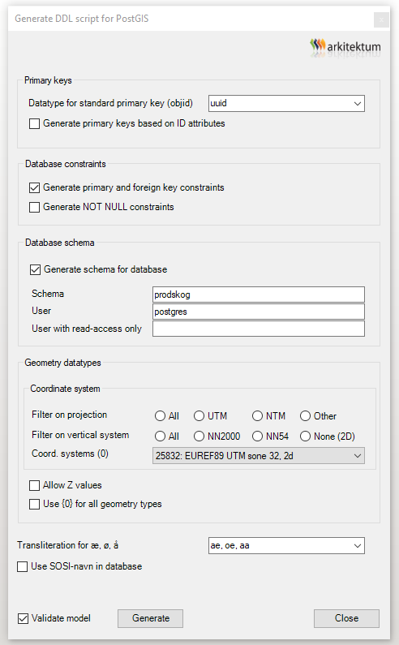

# Ukeoppgave om PSTools, GISTools, Postgis og FME

**NB! Denne er ikke helt oppdatert for 2025 enda - kommer innen 27.03**

## Mål for oppgaven

Få erfaring og trening med å lage produktspesifikasjoner i PSTools, opprette databaseskjema i PostGIS i samsvar med dette og laste opp data i databasen.

Dette forutsetter bruk av programvarene som er listet opp nedenfor.

## Beskrivelse av oppgaven

Oppgaven baseres på arealressursdata - AR5. Du skal opprette en produktspesifikasjon for et utvalg av AR5-data - arealer med produktiv skog. Det er ingen eksakt fasit for hvordan dette skal gjøres, men videoene nedenfor viser hvordan det kan gjøres.

For ukeoppgaven bruker alle samme datasett - AR5-data for Hjelmeland kommune.

Oppgaven vil lede deg gjennom arbeidsoppgavene som skal gjøres i form av korte videosnutter. Det er mange detaljer der, så se nøye på de.

Oppgaven forutsetter at riktig programvare er installert på egen PC.

Les om Arealressurskart og AR5 spesielt her:

- [Oversikt over arealressurskart](https://www.nibio.no/tema/jord/arealressurser)
- [Nærmere om AR5](https://www.nibio.no/tema/jord/arealressurser/arealressurskart-ar5)
- [Produktark AR5](https://register.geonorge.no/data/documents/FKB-AR5_Produktark_S-L_FKB-AR5.pdf)
- [Produktspesifikasjon AR5](https://kartverket.no/globalassets/standard/sosi-kap3-produktspesifikasjoner/fkb-4.5/4-ar5-2014-03-01.pdf)
- [AR5 Klassifikasjonssystem](https://nibio.brage.unit.no/nibio-xmlui/handle/11250/2596511)

## Nødvendig programvare

Linker for nedlasting ligger i programvaretabellen. Lisens-informasjon ligger i Blackboard/Programvare.

- PSTools  Brukernavn og passord - se Blackboard/Programvare
- Sparx Enterprise Architect (EA) - Bruker lisensserver ved NTNU - krever VPN-oppkobling
- GISTools (tillegg til EA) - se Blackboard/Programvare for lisenskode
- 64-bit PostgreSQL/PostGIS
- FME og GeoSOSI Professional - Bruker lisensserver ved NTNU - krever VPN-oppkobling

## Datafil

- AR5-data for Hjelmeland kommune - se under Datafiler i venstremenyen i Blackboard
- [AR5-side på geonorge.no](https://kartkatalog.geonorge.no/metadata/uuid/280bbd7a-5ce9-4c83-9e15-ac162cabd8a6)

## Arbeidsoppgaver

- <a href="docs/Ukeoppgave-PSTools-m-m.pdf">Oversikt over arbeidsoppgaver (PDF)</a>

### Lage produktspesifikasjon i PSTools, hente ned prosjektfil for Enterprise Architect

<iframe src="https://ntnu.cloud.panopto.eu/Panopto/Pages/Embed.aspx?id=65643b77-4dda-4367-a7d4-acee012d4509&autoplay=false&offerviewer=true&showtitle=true&showbrand=false&start=0&interactivity=all" height="405" width="720" style="border: 1px solid #464646;" allowfullscreen allow="autoplay"></iframe>

### Klargjøre PostGIS-database

<iframe src="https://ntnu.cloud.panopto.eu/Panopto/Pages/Embed.aspx?id=b2005987-b6eb-4560-a2b7-acee012ea4c9&autoplay=false&offerviewer=true&showtitle=true&showbrand=false&start=0&interactivity=all" height="405" width="720" style="border: 1px solid #464646;" allowfullscreen allow="autoplay"></iframe>

### Lage SQL-script som kan opprette skjema i PostGIS-database

<iframe src="https://ntnu.cloud.panopto.eu/Panopto/Pages/Embed.aspx?id=bb181aa7-ae85-4a52-8742-acee012e4053&autoplay=false&offerviewer=true&showtitle=true&showbrand=false&start=0&interactivity=all" height="405" width="720" style="border: 1px solid #464646;" allowfullscreen allow="autoplay"></iframe>

Korrekt bestillingsbilde for SQL-generering (videoen ovenfor har feil avkryssing på _Generate NOT NULL constraints_ ):

### Lage workspace i FME Workbench for opplasting av data

NB: Se også neste video (Kjøre workspace-fil med aktuelle data) for å få litt oppdatering på siste FME-versjon

<iframe src="https://ntnu.cloud.panopto.eu/Panopto/Pages/Embed.aspx?id=eeee8836-6679-4da8-9232-ae5d00ce6acb&autoplay=false&offerviewer=true&showtitle=true&showbrand=false&start=0&interactivity=all" height="405" width="720" style="border: 1px solid #464646;" allowfullscreen allow="autoplay"></iframe>

### Kjøre workspace-fil med aktuelle data

<iframe src="https://ntnu.cloud.panopto.eu/Panopto/Pages/Embed.aspx?id=7271baa3-6fe0-4729-98c9-b2ac00fad334&autoplay=false&offerviewer=true&showtitle=true&showbrand=true&captions=false&interactivity=all" height="405" width="720" style="border: 1px solid #464646;" allowfullscreen allow="autoplay" aria-label="Panopto Embedded Video Player" aria-description="torsdag 11. april 2024 at 10:32:26" ></iframe>

### Sjekke innholdet i databasen med QGIS

<iframe src="https://ntnu.cloud.panopto.eu/Panopto/Pages/Embed.aspx?id=cd0dc820-e5a9-4c38-aaca-acee012ff3c3&autoplay=false&offerviewer=true&showtitle=true&showbrand=false&start=0&interactivity=all" height="405" width="720" style="border: 1px solid #464646;" allowfullscreen allow="autoplay"></iframe>

Lykke til!

_NTNU 17.03.2021 Sverre Stikbakke_
_NTNU 19.03.2022 Oppdatert FME-video_
